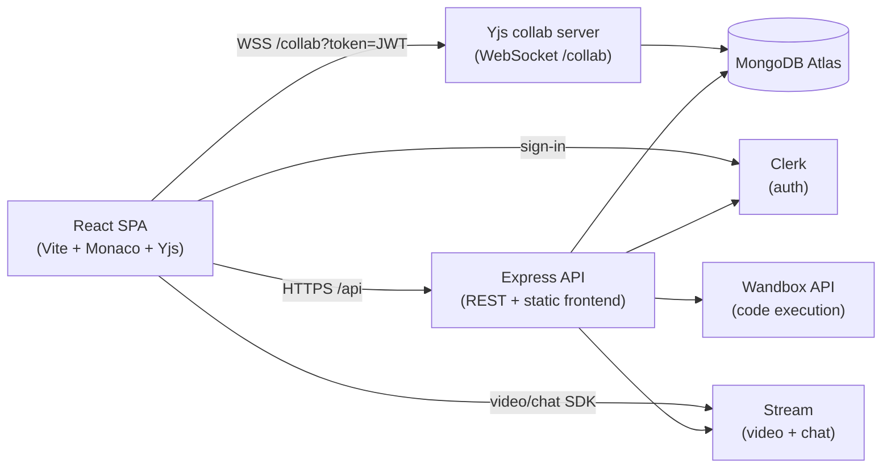

# DevIntervue — Real-Time Pair-Programming & Technical Interview Platform

[](https://devintervue.onrender.com)
[](https://react.dev)
[](https://nodejs.org)
[](https://mongodb.com)
[](https://yjs.dev)
[](https://render.com)

DevIntervue is a full-stack MERN application for **live collaborative coding interviews and pair-programming sessions**. Two users can join a session, talk over video, chat, and edit the same code in real time — with syntax-highlighted editing, multi-language code execution, and judge-style output checking.

🌐 **Live demo:** https://devintervue.onrender.com

Built as a **BTech final-year project**, the codebase is organised to demonstrate real engineering concerns: authentication, real-time collaboration (CRDT), rate limiting, input validation, automated tests, and containerised deployment.

## ✨ Features

- **Real-time collaborative editor** — Yjs CRDT over WebSockets; keystrokes sync live with per-user cursors and presence colours (falls back to manual refresh if the socket drops)
- **Video + chat per session** — Stream Video calls and Stream Chat channels, created automatically with each session
- **Multi-language code execution** — JavaScript, Python, Java via the free Wandbox API, proxied through the backend (no key needed, nothing secret reaches the browser); optional self-hosted Piston mode
- **Judge-style output checking** — practice problems with expected outputs; a shared, tested normaliser compares results ignoring whitespace/formatting noise
- **Session lifecycle** — create, join (idempotent), end (host only); active vs. completed sessions on the dashboard
- **Authentication** — Clerk (sign-in/sign-up, JWT-verified on every request and on the collaboration WebSocket)
- **Hardening** — rate limiting (global + strict limit on code execution), input validation, JSON error responses, CORS allow-list, environment validation at startup
- **Automated tests** — 33 tests across backend and frontend with Node's built-in runner (`node:test`, zero test dependencies)
- **One-command local stack** — MongoDB + backend + frontend via Docker Compose

## 🏗️ Architecture



The production deploy is a **single Docker image** (Express serves the built React bundle) on Render's free tier, with MongoDB Atlas (free M0) for data and SaaS for auth/video/chat. Code execution uses the free Wandbox API — no key, no VPS, no cost.

## 🧱 Tech Stack

| Layer | Technology |
|---|---|
| Frontend | React 19, Vite, React Router, React Query, Tailwind CSS + DaisyUI |
| Editor | Monaco Editor + Yjs (`y-monaco` binding) |
| Real-time sync | Yjs CRDT over WebSocket (`y-websocket`), Clerk-JWT authenticated |
| Backend | Node.js 20, Express 5 |
| Database | MongoDB (Mongoose, Atlas in production) |
| Auth | Clerk (`@clerk/express`, `@clerk/react`) |
| Video / Chat | Stream (`@stream-io/node-sdk`, `stream-chat`) |
| Code execution | Wandbox API (default, free) · Piston (optional self-hosted mode) |
| Background jobs | Inngest (user cleanup on delete) |
| Tests | `node:test` + `node:assert` (no extra deps) |
| Deploy | Render Blueprint (`render.yaml`), Docker Compose for local dev |

## 🚀 Quick Start

### Option A — Docker (recommended)

```bash
docker compose up -d
```

- Frontend: http://localhost:5173
- Backend: http://localhost:3000 (`/health` for a quick check)
- MongoDB: `mongodb://localhost:27018`

```bash
docker compose logs -f   # follow logs
docker compose down      # stop everything
```

### Option B — Local dev

```bash
npm install --prefix backend
npm install --prefix frontend
npm run dev --prefix backend    # http://localhost:3000
npm run dev --prefix frontend   # http://localhost:5173
```

You need: a [Clerk](https://clerk.com) application (publishable + secret key), [Stream](https://getstream.io) API key/secret, and a MongoDB connection string. Code execution works out of the box via Wandbox (no key needed).

See `backend/.env.example` and `frontend/.env.example` for the full variable list. The backend validates required variables at startup and exits with a clear message if any are missing.

### Deploying your own copy

A Render Blueprint (`render.yaml`) plus a step-by-step guide ([`DEPLOY.md`](DEPLOY.md)) takes the app from this repo to a public URL in about 20 minutes — free tier throughout (Render + MongoDB Atlas + Wandbox).

## 🧪 Testing

```bash
npm test --prefix backend    # 24 tests
npm test --prefix frontend   # 9 tests
```

Covered: output normalisation & matching (the judge, both backend and frontend copies), the Wandbox executor (payload mapping, error shapes), environment validation, and server wiring (module imports cleanly, `/health` responds, unauthenticated API access is rejected). No test framework to install — it uses Node's built-in runner.

## 📡 API Reference

| Method | Endpoint | Auth | Purpose |
|---|---|---|---|
| `GET` | `/health` | No | Health check (JSON) |
| `GET` | `/api/chat/token` | Yes | Stream token for video/chat client |
| `POST` | `/api/sessions` | Yes | Create coding session |
| `GET` | `/api/sessions/active` | Yes | List active sessions |
| `GET` | `/api/sessions/my-recent` | Yes | List recent completed sessions |
| `GET` | `/api/sessions/:id` | Yes | Fetch session details |
| `POST` | `/api/sessions/:id/join` | Yes | Join session as participant (idempotent) |
| `PATCH` | `/api/sessions/:id/code` | Yes | Persist shared code + language (debounced) |
| `POST` | `/api/sessions/:id/end` | Yes | End session (host only) |
| `POST` | `/api/code/execute` | Yes | Execute code via backend executor proxy |

Real-time collaboration runs on a separate WebSocket endpoint: `ws(s)://<backend>/collab/<sessionId>?token=<clerk-jwt>`. The token is verified and the user must be the host or a participant of an **active** session.

## 🗂️ Project Structure

```
DevIntervue/
├── backend/
│   ├── src/
│   │   ├── server.js              # Express app + HTTP server + WS attach (exports app for tests)
│   │   ├── controllers/           # chat, code (Wandbox/Piston executor), session lifecycle
│   │   ├── lib/
│   │   │   ├── collab.js          # Yjs WebSocket server (auth, per-session docs)
│   │   │   ├── judge.js           # output normalisation / matching (tested)
│   │   │   ├── stream.js          # lazy Stream clients (no import-time crashes)
│   │   │   ├── env.js             # env parsing + validateEnv()
│   │   │   └── db.js / inngest.js
│   │   ├── middleware/            # protectRoute (Clerk), rateLimit
│   │   ├── models/                # User, Session
│   │   └── routes/
│   └── tests/                     # node:test suites (24 tests)
├── frontend/
│   └── src/
│       ├── hooks/useCollab.js     # Yjs doc + provider + awareness
│       ├── lib/judge.js           # shared judge utils (mirrors backend, tested)
│       ├── lib/ws.js              # collaboration WebSocket URL builder
│       ├── components/            # CodeEditorPanel (Yjs-bound), OutputPanel, …
│       └── pages/                 # Dashboard, Session, Problem practice, 404
├── docs/                          # academic documentation
│   ├── ARCHITECTURE.md
│   ├── VIVA_PREP.md
│   └── REPORT_OUTLINE.md
├── render.yaml                    # Render Blueprint (one-container production deploy)
└── docker-compose.yml             # local dev stack (MongoDB + backend + frontend)
```

## 📚 Academic Documentation

- [`docs/ARCHITECTURE.md`](docs/ARCHITECTURE.md) — system architecture, component & data-flow diagrams, ER diagram, real-time sync design
- [`docs/VIVA_PREP.md`](docs/VIVA_PREP.md) — likely viva questions with concise answers
- [`docs/REPORT_OUTLINE.md`](docs/REPORT_OUTLINE.md) — chapter-by-chapter final-year report outline

## ✅ Demo Checklist

1. Sign in with two accounts (e.g. two browsers)
2. Account A creates a session; account B joins from the dashboard
3. Verify video + chat connect in both windows
4. Type in account A's editor — text appears live in account B (cursor labels visible)
5. Disconnect network briefly — editor shows *Offline*, falls back to Refresh Code
6. Switch language, run code in both Problem and Session pages
7. Host ends the session; participant is redirected to the dashboard

## 🔮 Future Scope

- 3+ participant sessions with roles (interviewer/candidate/observer)
- Timed contest mode with scoring and leaderboard
- Submission history and plagiarism similarity checks
- Interview scheduling with calendar invites
- CI/CD pipeline with observability (metrics, tracing)
